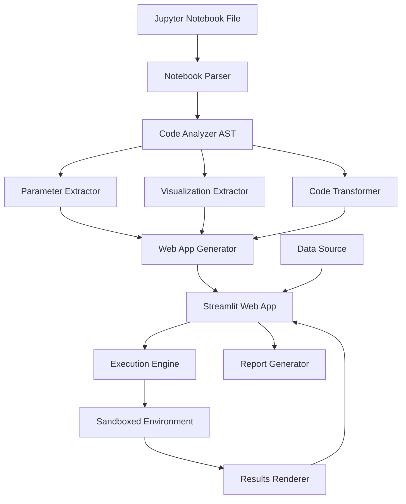

# Jupyter Notebook to Interactive Web Application Converter - Product Requirements Document

## Executive Summary

### Problem Statement

Data scientists and analysts create valuable analysis workflows in Jupyter Notebooks, but these notebooks are not easily shareable with non-technical stakeholders. Notebooks require technical setup (Jupyter installation, dependency management), lack interactive parameter adjustment capabilities, and don't provide a polished user experience for exploring analysis results. Converting notebooks to web applications manually is time-consuming, error-prone, and requires significant development effort.

### Proposed Solution

Develop an automated system that converts Jupyter Notebooks into interactive web applications. The system will parse notebook structure, extract analysis logic, identify parameterizable variables, convert visualizations to web components, and create an interactive interface where users can adjust parameters and see real-time results. The solution will preserve the original analysis logic while providing a user-friendly web interface accessible to non-technical users.

### Expected Impact

- **User Benefits**: Easy sharing of analysis results without technical setup, interactive parameter exploration, professional report generation, and no Jupyter installation required for end users
- **Business Value**: Faster insights delivery to stakeholders, improved collaboration between technical and non-technical teams, reusable analysis templates, and reduced manual conversion effort
- **Technical Value**: Automated conversion pipeline that can be applied to multiple notebooks, extensible architecture for custom visualizations, and demonstration of code analysis and transformation capabilities

### Success Metrics

- Notebook parsing time &lt; 5 seconds for notebooks with up to 100 cells
- Data loading time &lt; 3 seconds for files up to 10MB
- Analysis execution time &lt; 10 seconds for moderate complexity analyses
- Chart rendering time &lt; 2 seconds
- Conversion accuracy &gt; 90% for standard notebooks
- Parameter identification accuracy &gt; 85%
- User satisfaction score &gt; 4.0/5.0

## Requirements & Scope

### Functional Requirements

**REQ-1: Notebook Parsing and Analysis**The system must parse Jupyter Notebook (.ipynb) files, identify code cells, markdown cells, and output cells, extract data loading and processing logic, identify visualization code (Matplotlib, Plotly, Seaborn), and extract parameters and configuration items.

**REQ-2: Code Conversion and Modularization**The system must convert notebook code into modular Python functions, identify parameterizable variables (data source paths, analysis parameters, configuration values), extract data visualization code and convert to web components, and handle dependencies (import statements, function calls, cell execution order).

**REQ-3: Structure Reorganization**The system must create clear module structure (data loading, data processing, visualization, export), generate configuration files (parameter configs, data source configs), generate dependency files (requirements.txt), and maintain code execution order from original notebook.

**REQ-4: Interactive Data Loading**The system must support multiple data source types (CSV/Excel file upload, database connections for PostgreSQL/MySQL/SQLite, API data fetching, example dataset selection), provide data preview (basic info, sample rows, statistics, data quality checks), and offer data cleaning options (missing value handling, data type conversion, filtering, deduplication).

**REQ-5: Parameterized Analysis Configuration**The system must identify hardcoded parameters in notebooks, create parameter configuration interface, support multiple parameter types (numeric sliders/inputs, categorical dropdowns/multi-select, boolean toggles, date pickers), validate parameter ranges and dependencies, and support parameter presets (save, load, share configurations).

**REQ-6: Interactive Visualization**The system must support at least 5 chart types (line charts, bar charts, scatter plots, heatmaps, box plots, histograms, 3D charts when applicable), provide interactivity (zoom, pan, hover tooltips), enable real-time chart updates on parameter changes, support chart linking (synchronized updates across charts), and allow chart configuration (color themes, size, axes, legends).

**REQ-7: Analysis Results Display**The system must display key metric cards (KPIs), statistical summary tables, data summary information, and analysis conclusions/recommendations (when available in notebook markdown cells).

**REQ-8: Data Export Functionality**The system must support exporting charts (PNG, SVG, PDF), exporting data (CSV, Excel), exporting complete reports (PDF, HTML), and exporting notebook format (.ipynb) with updated parameters.

**REQ-9: Report Generation**The system must provide standard analysis report templates, support custom report structure, generate reports with execution summary, data overview, analysis results, visualizations, and conclusions/recommendations, and export in PDF, HTML, and Markdown formats.

**REQ-10: Code Execution Safety**The system must provide secure code execution environment (sandbox), handle errors and exceptions gracefully, display execution progress, log execution activities, and prevent dangerous operations (file system access, network requests unless explicitly allowed).

**REQ-11: Responsive Layout**The system must support desktop (1920x1080+), tablet (768px+), and optionally mobile layouts (768px-) with main functionality accessible on smaller screens.

### Non-Functional Requirements

**NFR-1: Performance**

- Notebook parsing time must be &lt; 5 seconds for notebooks with up to 100 cells
- Data loading time must be &lt; 3 seconds for files up to 10MB
- Analysis execution time must be &lt; 10 seconds for moderate complexity analyses
- Chart rendering time must be &lt; 2 seconds
- Parameter adjustment response time must be &lt; 1 second

**NFR-2: Code Quality**Code must follow Python PEP 8 standards, include comprehensive docstrings, have clear function and class naming, be modular and maintainable, and achieve &gt; 70% test coverage.

**NFR-3: Security**The system must implement secure code execution sandbox, restrict dangerous operations (file system writes, network access, system calls), validate all user inputs, and encrypt sensitive data in transit.

**NFR-4: Error Handling**The system must provide clear error messages for parsing failures, graceful handling of code execution errors, user-friendly notifications for data loading issues, and recovery mechanisms for failed operations.

**NFR-5: Dependency Management**The system must automatically detect notebook dependencies, generate accurate requirements.txt, handle version conflicts, provide dependency installation guidance, and support virtual environment creation.

**NFR-6: Conversion Accuracy**The system must achieve &gt; 90% conversion accuracy for standard notebooks, correctly identify &gt; 85% of parameterizable variables, preserve all visualization code, and maintain analysis logic integrity.

### Out of Scope

- Support for R or Julia notebooks (Python only)
- Real-time collaborative editing
- Advanced machine learning model training interfaces with GPU support
- Custom programming language support
- Multi-language UI (English only for initial version)
- Cloud deployment automation (deployment instructions provided)
- Version control integration (Git operations)

### Success Criteria

- All functional requirements (REQ-1 through REQ-11) are implemented and tested
- All non-functional requirements (NFR-1 through NFR-6) are met
- Conversion accuracy &gt; 90% for standard notebooks
- Parameter identification accuracy &gt; 85%
- Unit test coverage &gt; 70%
- Integration tests pass for all conversion scenarios
- Performance benchmarks meet specified targets
- User acceptance testing achieves &gt; 4.0/5.0 satisfaction score

## User Stories

### Personas

- **Data Scientist**: Creates analysis notebooks and wants to share them with stakeholders
- **Business Analyst**: Needs to explore analysis results with different parameters
- **Stakeholder**: Wants to view analysis results without technical setup
- **Developer**: Needs to extend the conversion system for custom requirements

### Core User Stories

**US-1: As a Data Scientist, I want to convert my Jupyter Notebook to a web application, so that I can share my analysis with non-technical stakeholders.**

- **Priority**: Must
- **Acceptance Criteria**: 
  - Given I have a Jupyter Notebook file (.ipynb)
  - When I upload the notebook to the conversion system
  - Then the system parses the notebook structure
  - And identifies code cells, markdown cells, and outputs
  - And extracts data loading and processing logic
  - And generates a web application structure
  - And provides a preview of the converted application
- **Related Requirements**: REQ-1, REQ-2, REQ-3

**US-2: As a Data Scientist, I want the system to identify parameters in my notebook, so that users can adjust analysis settings.**

- **Priority**: Must
- **Acceptance Criteria**: 
  - Given my notebook contains hardcoded parameters
  - When the system analyzes my notebook
  - Then it identifies parameterizable variables
  - And creates a parameter configuration interface
  - And supports different parameter types (numeric, categorical, boolean, date)
  - And validates parameter ranges
  - And I can review and adjust identified parameters
- **Related Requirements**: REQ-5

**US-3: As a Business Analyst, I want to load different datasets, so that I can analyze various data sources.**

- **Priority**: Must
- **Acceptance Criteria**: 
  - Given I am using the converted web application
  - When I navigate to the data loading section
  - Then I can upload CSV/Excel files
  - And I can connect to databases (if notebook supports it)
  - And I can select from example datasets
  - And I can preview the loaded data
  - And I can see data quality information
- **Related Requirements**: REQ-4

**US-4: As a Business Analyst, I want to adjust analysis parameters and see real-time results, so that I can explore different scenarios.**

- **Priority**: Must
- **Acceptance Criteria**: 
  - Given I have loaded data and the analysis is ready
  - When I adjust a parameter (e.g., time range, filter condition, analysis method)
  - Then the analysis re-runs automatically
  - And charts update in real-time (&lt; 1 second response)
  - And results are displayed immediately
  - And I can see execution progress
  - And errors are displayed clearly if analysis fails
- **Related Requirements**: REQ-5, REQ-6, NFR-1

**US-5: As a Business Analyst, I want to view interactive charts, so that I can explore data visually.**

- **Priority**: Must
- **Acceptance Criteria**: 
  - Given analysis results are available
  - When I view the visualization section
  - Then I see charts from the original notebook
  - And I can interact with charts (zoom, pan, hover)
  - And I can configure chart settings (colors, size, axes)
  - And multiple charts can be displayed in a grid layout
  - And charts update when parameters change
  - And I can export charts as images
- **Related Requirements**: REQ-6, REQ-8

**US-6: As a Stakeholder, I want to export analysis results and reports, so that I can share insights with my team.**

- **Priority**: Must
- **Acceptance Criteria**: 
  - Given I have completed an analysis
  - When I click the export button
  - Then I can export charts (PNG, SVG, PDF)
  - And I can export data (CSV, Excel)
  - And I can generate a complete report (PDF, HTML)
  - And exported files are correctly formatted
  - And files download successfully
- **Related Requirements**: REQ-8, REQ-9

**US-7: As a Data Scientist, I want to see how my notebook code was converted, so that I can verify the conversion accuracy.**

- **Priority**: Should
- **Acceptance Criteria**: 
  - Given my notebook has been converted
  - When I review the generated code
  - Then I can see the modularized Python functions
  - And I can see how parameters were extracted
  - And I can see how visualizations were converted
  - And I can understand the code structure
  - And I can make manual adjustments if needed
- **Related Requirements**: REQ-2, REQ-3

**US-8: As a Business Analyst, I want to use the application on my tablet, so that I can review analysis results while away from my desk.**

- **Priority**: Could
- **Acceptance Criteria**: 
  - Given I am using a tablet device
  - When I access the web application
  - Then the interface adapts to tablet screen size
  - And all core functionality is accessible
  - And charts are readable and interactive
  - And the layout is optimized for touch interaction
- **Related Requirements**: REQ-11

## User Experience & Interface

### User Journey

1. **Notebook Conversion** (Data Scientist)

   - User uploads Jupyter Notebook file
   - System analyzes and parses notebook
   - User reviews conversion preview
   - User adjusts conversion settings if needed
   - System generates web application
   - User tests the converted application

2. **Analysis Exploration** (Business Analyst/Stakeholder)

   - User opens converted web application
   - User loads or selects dataset
   - User previews data and quality information
   - User adjusts analysis parameters
   - User views interactive charts and results
   - User exports results or generates report

3. **Report Generation** (Stakeholder)

   - User completes analysis exploration
   - User configures report settings
   - User generates report (PDF/HTML)
   - User reviews and downloads report
   - User shares report with team

### Interface Requirements

**Layout Structure**:

- **Top Navigation Bar**: Application title/logo, notebook info display, help documentation link, settings button
- **Sidebar**: Data loading panel, parameter configuration panel, analysis step navigation (when applicable)
- **Main Content Area**: Data preview area, visualization chart area (multi-column layout), analysis results panel
- **Bottom Toolbar**: Run analysis button, export functions, report generation button

**Visual Design**:

- Clean, professional interface following modern web application design principles
- Consistent color scheme and typography
- Clear visual hierarchy
- Intuitive iconography and labeling
- Chart-focused design with ample white space

**Interaction Patterns**:

- Click to select, drag to adjust sliders, hover to preview
- Clear visual feedback for all actions
- Loading indicators for async operations
- Toast notifications for success/error messages
- Modal dialogs for configuration and exports

### Accessibility Considerations

- Keyboard navigation support for main functions
- Screen reader compatibility for chart data
- Sufficient color contrast (WCAG AA compliance)
- Clear text labels and instructions
- Alternative text for charts

## Technical Considerations

### High-Level Technical Approach

The system will use nbformat library to parse Jupyter Notebook files, analyze code structure using AST (Abstract Syntax Tree), extract parameterizable variables through static analysis, convert visualization code to web components (Plotly for Streamlit), and generate modular Python code with clear separation of concerns. Code execution will be sandboxed for security.

### Integration Points

- Jupyter Notebook file format (.ipynb) via nbformat
- Web framework (Streamlit) for UI rendering
- Data processing libraries (Pandas, NumPy) for analysis execution
- Visualization libraries (Plotly, Matplotlib) for chart generation
- Report generation libraries (ReportLab, WeasyPrint) for PDF/HTML export
- Code execution sandbox for secure notebook code running

### Key Technical Constraints

- Notebook code execution must be sandboxed for security
- Large datasets require efficient memory management
- Complex analysis may have long execution times requiring async handling
- Different notebook structures require flexible parsing logic
- Python-only notebooks (R/Julia not supported)

### Performance Considerations

- Implement caching for parsed notebook structures
- Use lazy loading for large datasets
- Optimize chart rendering by limiting data points
- Implement progress tracking for long-running analyses
- Use async execution for analysis tasks
- Implement code execution timeout mechanisms

### Scalability Considerations

- Design modular conversion pipeline for different notebook types
- Support plugin architecture for custom visualization conversions
- Implement configuration-driven approach for conversion rules
- Design for horizontal scaling if needed in future
- Support batch conversion for multiple notebooks

## Design Specification

### Recommended Approach

Build a multi-stage conversion pipeline: (1) Notebook parsing stage using nbformat to extract structure, (2) Code analysis stage using AST to identify patterns and parameters, (3) Code transformation stage to modularize and parameterize code, (4) Web application generation stage to create UI components and wire them together, (5) Execution engine with sandboxed environment for running converted code safely.

### Key Technical Decisions

#### 1. Notebook Parsing Strategy

- **Options Considered**: Direct JSON parsing vs nbformat library vs Custom parser
- **Tradeoffs**: 
  - Direct JSON parsing: Simple but misses notebook semantics
  - nbformat library: Handles notebook format correctly, provides structure, but adds dependency
  - Custom parser: Full control but high maintenance
- **Recommendation**: nbformat library - industry standard, well-maintained, handles edge cases, provides clear notebook structure representation

#### 2. Code Analysis Approach

- **Options Considered**: String parsing vs AST analysis vs Pattern matching
- **Tradeoffs**: 
  - String parsing: Simple but fragile, misses context
  - AST analysis: Accurate, understands code structure, but complex
  - Pattern matching: Fast but limited to known patterns
- **Recommendation**: AST analysis - most accurate approach, enables sophisticated parameter identification, supports complex code transformations, essential for reliable conversion

#### 3. Web Framework Selection

- **Options Considered**: Streamlit vs Flask/FastAPI + React vs Django
- **Tradeoffs**: 
  - Streamlit: Rapid development, good for data apps, but less flexible
  - Flask/FastAPI: Flexible, mature, but requires more boilerplate
  - Django: Full-featured but overkill for this application
- **Recommendation**: Streamlit - best fit for data analysis applications, rapid prototyping, excellent visualization integration, reduces development time significantly

#### 4. Code Execution Security

- **Options Considered**: Full sandbox vs Restricted execution vs Docker containers
- **Tradeoffs**: 
  - Full sandbox: Most secure but complex, may limit functionality
  - Restricted execution: Balanced security and functionality, requires careful implementation
  - Docker containers: Isolated but resource-intensive, deployment complexity
- **Recommendation**: Restricted execution with whitelist - balance security and functionality, implement dangerous operation blocking, allow necessary libraries, provide clear security documentation

#### 5. Parameter Identification Strategy

- **Options Considered**: Static analysis vs Runtime detection vs Manual annotation
- **Tradeoffs**: 
  - Static analysis: Automated but may miss dynamic cases
  - Runtime detection: Accurate but requires execution, may be slow
  - Manual annotation: Most flexible but requires user effort
- **Recommendation**: Hybrid approach - use static analysis for automatic detection, provide manual annotation interface for edge cases, combine both for best results

### High-Level Architecture

### Key Considerations

- **Performance**: Implement multi-stage caching (parsed notebooks, analysis results, execution results) and use async execution for long-running analyses to ensure responsive UI
- **Security**: Implement comprehensive sandbox restrictions (file system access, network access, system calls), validate all user inputs, and audit code execution for suspicious patterns
- **Scalability**: Design plugin architecture for custom converters, use configuration-driven conversion rules to minimize code changes, and support batch conversion for multiple notebooks

### Risk Management

- **Technical Risk 1**: Complex notebook code may not convert accurately - Mitigation: Implement flexible parsing rules, provide manual adjustment interface, support incremental conversion with user feedback
- **Technical Risk 2**: Code execution security vulnerabilities - Mitigation: Implement comprehensive sandbox with operation whitelist/blacklist, conduct security audit, provide clear security documentation
- **Technical Risk 3**: Performance issues with large notebooks or datasets - Mitigation: Implement lazy loading, data sampling strategies, progress tracking, and async execution
- **Technical Risk 4**: Dependency conflicts between notebook and web app environments - Mitigation: Automatic dependency detection, version conflict resolution, clear dependency documentation

### Success Criteria

- Notebook parsing successfully handles 90%+ of standard notebooks
- Parameter identification accuracy &gt; 85%
- Code conversion produces runnable web applications
- All visualization types from notebook are correctly converted
- Web application performance meets specified benchmarks
- Security sandbox prevents dangerous operations

## Dependencies & Assumptions

### External Dependencies

- nbformat for Jupyter Notebook parsing
- ast (Python standard library) for code analysis
- Streamlit for web framework
- Pandas, NumPy for data processing
- Plotly, Matplotlib for visualizations
- ReportLab/WeasyPrint for PDF generation
- Database drivers for database connections

### Assumptions

- Input notebooks are valid Jupyter Notebook format (.ipynb)
- Notebook code is Python-based (not R or Julia)
- Notebooks follow reasonable coding practices (not overly obfuscated)
- Data sources are accessible from deployment environment
- Users have appropriate permissions for data access
- Notebook dependencies are installable in target environment
- Single-user application (no authentication required initially)

## Risk Assessment

### Technical Risks

1. **Conversion Accuracy**: Complex or unconventional notebook structures may not convert correctly

   - **Impact**: High - Core functionality affected
   - **Mitigation**: Implement flexible parsing with fallback options, provide manual adjustment interface, support common notebook patterns first

2. **Code Execution Security**: Executing user notebook code poses security risks

   - **Impact**: Critical - Security vulnerability
   - **Mitigation**: Implement comprehensive sandbox, restrict dangerous operations, conduct security audits, provide clear security guidelines

3. **Performance with Large Notebooks**: Parsing and converting large notebooks may be slow

   - **Impact**: Medium - User experience degradation
   - **Mitigation**: Implement caching, optimize parsing algorithms, provide progress indicators, support incremental processing

4. **Dependency Management**: Notebook dependencies may conflict with web app requirements

   - **Impact**: Medium - Deployment challenges
   - **Mitigation**: Automatic dependency detection, version conflict resolution, clear documentation, virtual environment support

### User Experience Risks

1. **Learning Curve**: Users may need time to understand converted web application

   - **Impact**: Low - Temporary adoption barrier
   - **Mitigation**: Provide comprehensive documentation, tooltips, example notebooks, video tutorials

2. **Conversion Limitations**: Some notebook features may not convert perfectly

   - **Impact**: Medium - User frustration
   - **Mitigation**: Clear documentation of limitations, provide manual adjustment options, prioritize common use cases